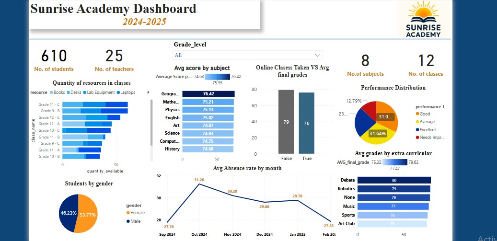

# 🏫 Power BI Project 1 — Sunrise Academy Dashboard

## 🎯 Project Overview
This dashboard provides an analytical overview of **Sunrise Academy** for the academic year **2024–2025**.  
It visualizes key educational data such as student performance, teacher count, attendance trends, and resource allocation.

---

## 📊 Dashboard Insights
- **Students & Teachers Overview:**  
  Total of **610 students** and **25 teachers** distributed across **12 classes** and **8 subjects**.

- **Resources Analysis:**  
  Shows the quantity of resources (Books, Desks, Lab Equipment, Laptops) across different grades to evaluate distribution efficiency.

- **Performance Insights:**  
  Visualizes students' average scores by subject and highlights overall performance levels (Excellent, Good, Average, Needs Improvement).

- **Attendance Patterns:**  
  Tracks monthly absence rates to identify trends and possible areas of concern.

- **Online Classes vs Grades:**  
  Compares students’ final grades between those who attended online classes and those who didn’t.

- **Extra-Curricular Impact:**  
  Shows how participation in activities like Debate, Robotics, and Music affects final grades.

---

## 🧠 Key Learnings
- Enhanced skills in **data modeling**, **visual design**, and **interactive filtering** in Power BI.  
- Gained insights into how academic and resource data can support decision-making for schools.

---

## 🧰 Tools Used
- Microsoft Power BI  
- Excel (for data cleaning and preparation)

---

## 🖼️ Dashboard Preview

---

## 📁 Files Included
- `educational.pbix` → Power BI file  
- `attendance.csv
- classes.csv
- enrollments.csv
- resources.csv
- students.csv
- subjects.csv
- teachers.csv` → Raw data (sample)  
- `Educational Dashboard.jpg` → Dashboard preview image  

---

## 👩‍💻 Author
**Shahd Ashraf**  
🎓 Faculty of Commerce – Business Information Systems (Helwan University)  
💡 Passionate about data visualization & analytics

